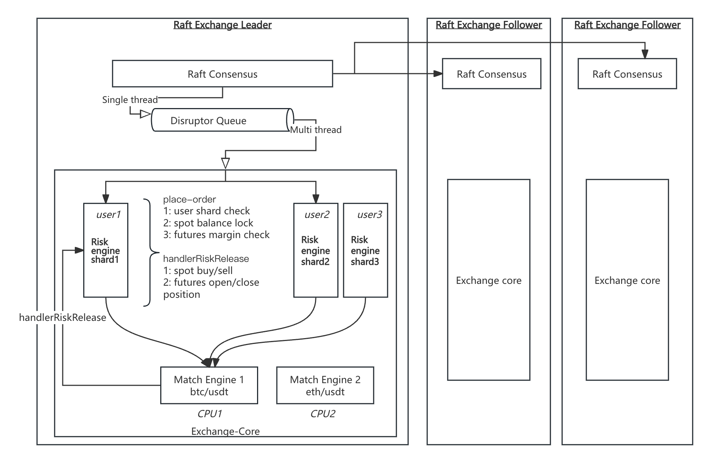

# Raft-Exchange
本项目是一个面向现货与合约交易的高性能撮合与风控核心，在经典 exchange-core 架构基础上，围绕 一致性、可扩展性、风控确定性 进行了系统化改造。

## 项目简介
系统采用 Raft 共识 + 单写多阶段执行模型，通过 用户分片的 Risk Engine 与 按交易对分区的 Matching Engine，在保证强一致性的前提下，实现高吞吐、低延迟和清晰的职责边界。

### 整体架构概览

系统整体分为：
1.	Raft 共识层
-	基于 JRaft 实现
-	所有写请求通过 Leader 进入 Raft Log
-	日志在多数节点达成一致后才会被执行
-	支持快照与日志回放，用于快速恢复

2.	Exchange-Core 执行层
-	基于 Disruptor 的事件驱动执行管道
-	风控(R1)、撮合(ME)、后处理(R2)在同一执行管道内完成
-   支持现货与合约交易场景
-   内置强平与风险释放流程

### 开发注意
在写代码之前请进行 mvn clean compile 以确保pb编译器生产对应grpc java代码