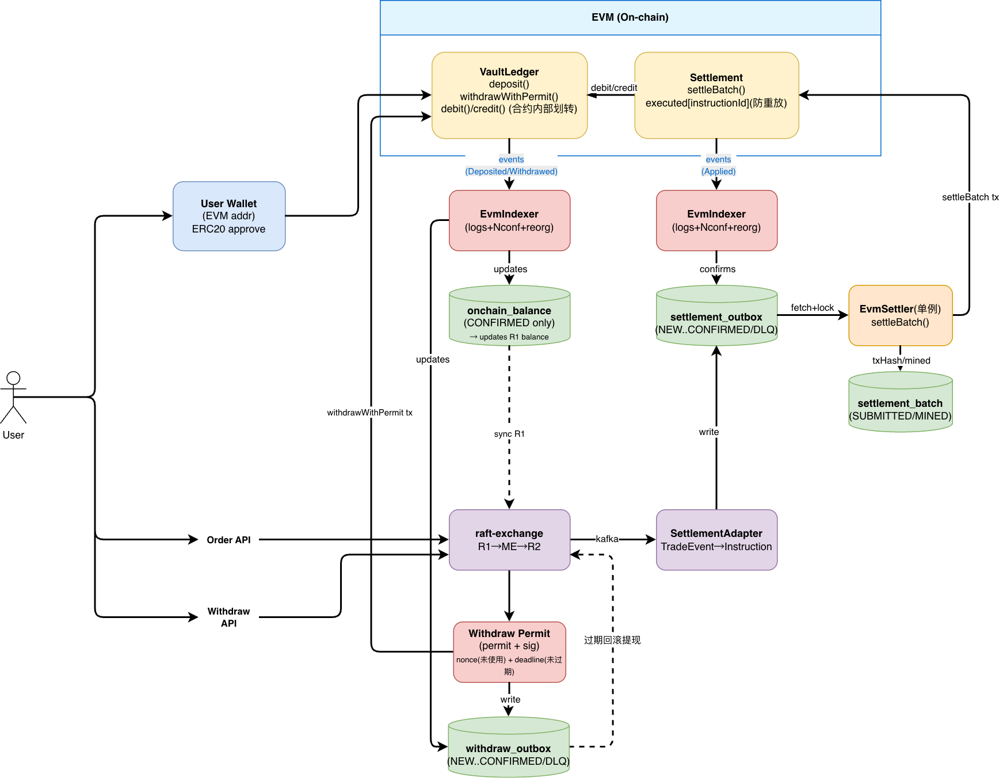

链下撮合（raft-exchange）+ 链上结算（EVM）

----

### 核心目标

- 撮合与风控在链下（raft-exchange）：保持低延迟与既有语义（R1 → ME → R2）。
- 资金托管与最终余额在链上（EVM）：充值/提现/成交结算都以链上状态为准。
- 可信结算者模式：允许平台作为 Settler 批量上链结算。

### 整体流程设计

### 模块与职责

#### 1.EVM（On-chain）合约

1.1 VaultLedger

职责

- 托管资产：用户 deposit 充值 token 到合约。
- 维护内部余额账本：balance[address][token]。
- 提现门控：withdrawWithPermit(permit,sig)，无 permit 不允许提现。
- 提供内部记账接口 debit/credit，仅允许 Settlement 合约调用。

> deposit/withdraw 是真实 ERC20 资金进出；debit/credit 是合约内部账本划转，不把 token 转出合约。

1.2 Settlement

职责

- 批量执行结算指令：settleBatch(batchId, Instruction[])
- 防重放：executed[instructionId]（同一指令只能执行一次）
- 通过调用 VaultLedger 的 debit/credit 修改内部账本

#### 2 Off-chain（链下服务）

2.1 EvmIndexer

职责

A. Vault 事件索引（Deposited/Withdrawn）

- 监听 VaultLedger 的 Deposited/Withdrawn
- 按 Nconf 确认后更新 onchain_balance (CONFIRMED only)
- 将 confirmed 余额同步给 raft-exchange（R1 balance sync）

B. Settlement 事件索引（Applied）

- 监听 Settlement 的 InstructionApplied
- 按 Nconf 确认后回写 settlement_outbox（NEW→…→CONFIRMED）
- 处理 reorg：已 SEEN 未 CONFIRMED 的事件消失则回滚，并将 outbox 指令退回可重试状态

2.2 raft-exchange

职责

- 核心撮合系统

2.3 SettlementAdapter

职责

- 从 raft-exchange R2 输出的交易事件（TradeEvent）生成结算 Instruction
- 写入 settlement_outbox

2.4 EvmSettler

职责

- 从 settlement_outbox fetch+lock 拉取 NEW 指令
- 组 batch，发送链上交易调用 Settlement.settleBatch()
- 记录 txHash/mined 到 settlement_batch

2.5 Withdraw Permit

职责

- 记录提现请求从链下批准到链上最终确认的全过程
- 支持 deadline 到期自动 EXPIRE 并回滚（释放链下冻结）

### 核心链路

#### 1.Deposit（充值）

1. User Wallet
    - ERC20 approve
    - 调用 VaultLedger.deposit(...)（链上 tx）

2. VaultLedger
    - 托管入金，更新内部账本
    - emit Deposited

3. EvmIndexer（Vault events）
    - 监听 Deposited
    - 进入 SEEN，等待 Nconf
    - 达到 Nconf 后写入 onchain_balance(CONFIRMED only)

4. sync R1
    - 将 confirmed 余额同步给 raft-exchange 的 R1 balance

#### 2.Trade Settlement（成交结算上链）

1. User → Order API
2. raft-exchange
3. SettlementAdapter
    - 消费 R2 事件
    - 生成 Instruction[]
    - 写 settlement_outbox (NEW)
4. EvmSettler
    - fetch+lock 拉取 NEW 指令
    - 组 batch，发链上 tx 调 Settlement.settleBatch(batchId, Instruction[])
    - 写 settlement_batch 记录 txHash/mined
5. Settlement（on-chain）
    - 校验 executed[instructionId] 防重放
    - 调 VaultLedger debit/credit 修改内部余额
    - emit InstructionApplied
6. EvmIndexer（Applied events）
    - 监听 InstructionApplied
    - 达到 Nconf 后：将对应 settlement_outbox 指令标为 CONFIRMED
    - reorg 时：将未确认指令退回可重试，等待下次上链

> Settler 的 mined 不等于最终；最终以 Indexer 的 Nconf CONFIRMED 为准。

#### 3.Withdraw（提现：链下批准 + 链上执行）

1. User → Withdraw API
2. raft-exchange
    - 做 R1 风控校验 + 冻结/扣减链下余额（防继续下单）

3. Withdraw Permit 生成（链下）
    - 根据结果生成 withdraw_requestId，写入 withdraw_outbox (NEW/RESERVED)
    - 生成 permit + sig，permit 至少包含 nonce + deadline
    - 写入 withdraw_outbox (PERMIT_ISSUED) 并返回用户

4. User 上链执行提现
    - 调用 VaultLedger.withdrawWithPermit(permit, sig)（链上 tx）

5. VaultLedger
    - 校验 permit 签名/nonce/deadline
    - 扣内部余额并转出 ERC20
    - emit Withdrawn

6. EvmIndexer（Vault events）
    - 监听 Withdrawn，Nconf 后确认
    - 回写 withdraw_outbox 为 CONFIRMED

7. withdraw_outbox 超时回滚（过期处理）
    - 若到 deadline + grace 仍未看到 Withdrawn confirmed
    - 将 withdraw_outbox 标为 EXPIRED
    - 通知 raft-exchange 释放冻结/恢复余额

> - 提现必须链下先冻结，否则用户可以继续下单。
> - permit 使“链下批准”可在链上执行；链上无 permit 无法提现。
> - 过期必须回滚链下冻结，否则资金永久占用。

### Q&A

1.相比传统CEX的优势

解决“平台跑路/资金挪用”这类CEX最大的风险。
资金在链上透明可查，链上转入转出操作由用户控制，平台只能通过结算合约操作用户余额。

2.为什么 EVM 很难“共识阶段扫全体仓位”

在 EVM 链上，你要在一次交易里遍历全体账户/仓位，复杂度是 O(N)，很快就会因为 block gas limit 失败； 合约也不会自动运行，必须有人不断发交易触发。
因此 EVM perp 通常用 keeper/清算机器人链下扫描 + 链上点名 liquidate(account) 的模式，而不是链上全扫。

3.Hyperliquid 为什么“能扫”（或者为什么链上DEX的都要自建链）

Hyperliquid 的架构是“两层执行域共享同一共识”：

- HyperCore：原生交易执行域（现货/永续订单簿、成交、保证金与清算都在这里执行）
- HyperEVM：EVM 执行域（给通用合约/DeFi 用）

Hyperliquid 能把强平做成“系统级自动执行”，是因为清算是交易引擎状态机的一部分，随区块执行自然推进；它不依赖外部 keeper 逐个发
EVM 交易去触发，也不受 EVM 合约单笔 gas 上限的同样约束。

